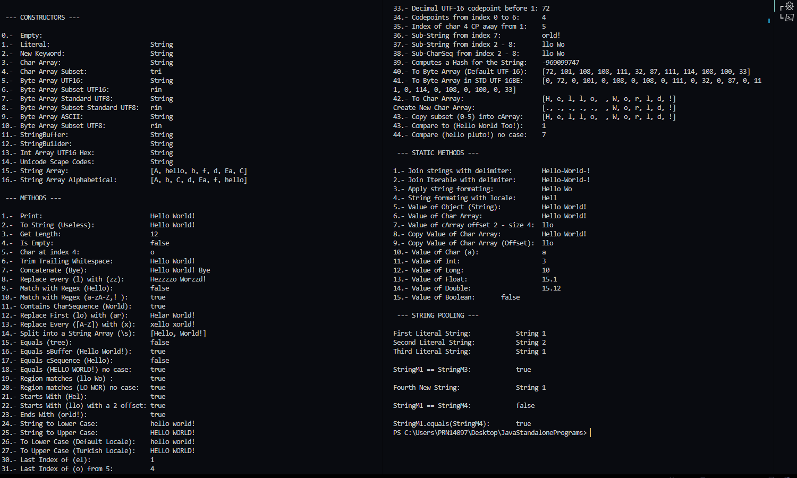
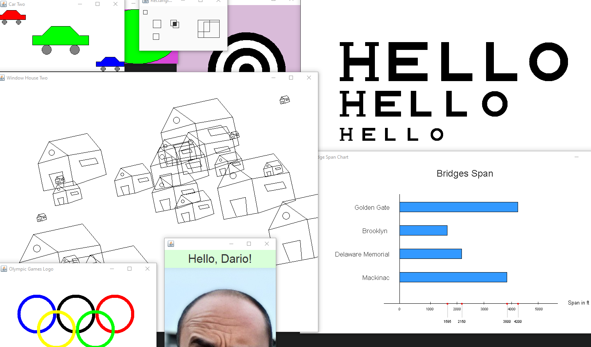

<br />
<div align="center">
  <h3 align="center">Java Scripts</h3>
  <p align="center">
    Standalone programs made in Java, mainly about the standard library and swing applications.
</div>

### Installation

1. Download [Java SDK](https://www.oracle.com/java/technologies/downloads/) 17+ from Oracle.
2. Clone the repo
   ```sh
   git clone https://github.com/DarioArzaba/JavaStandalonePrograms.git
   cd JavaStandalonePrograms
   ```
3. Download and configure an IDE like [Eclipse](https://www.eclipse.org/downloads/) or [Visual Studio Code](https://code.visualstudio.com/docs/java/java-debugging) to work with Java.
4. Open, edit and run any of the `java` files provided. Note that some of the files are purely classes intended to be imported by other files and can't be run directly since they lack a `main` entry point.

</br>
<div align="center"> <p> Example of java standard library class </p> </div>


</br>
<div align="center"> <p> Example of swing applications </p> </div>


## License

Distributed under the [MIT License](https://mit-license.org/).

## Contact

Dario Arzaba - dario.arzaba@gmail.com
